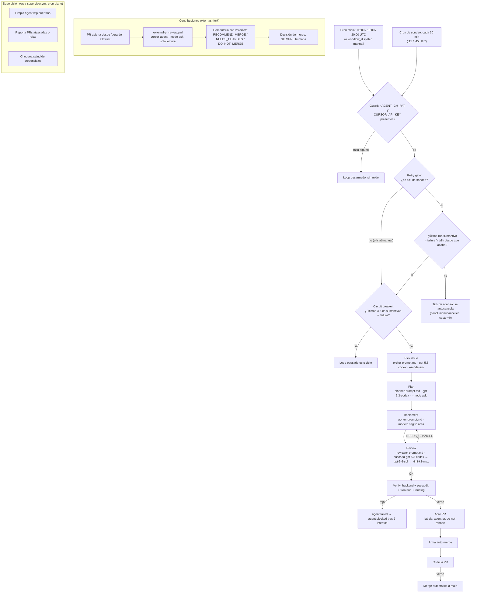

<p align="center">
  
</p>

<h3 align="center">Legislación española, viva y navegable.</h3>

<p align="center">
  Plataforma open source para explorar, analizar y consultar legislación española mediante grafos de conocimiento, IA y dashboards interactivos.
</p>

<p align="center">
  <a href="https://github.com/VforVitorio/LexFlow/blob/main/LICENSE"></a>
  <a href="https://www.python.org/"></a>
  <a href="https://react.dev/"></a>
  <a href="https://github.com/VforVitorio/LexFlow/issues"></a>
  
</p>

---

LexFlow transforma [legalize-es](https://github.com/legalize-dev/legalize-es) — el corpus de leyes españolas en Markdown, versionado con Git — en una plataforma interactiva para explorarlas, entenderlas y consultarlas. Objetivo final: una app de escritorio standalone, sin Docker ni Python para el usuario.

## Desarrollo autónomo (loop engineering)

El roadmap restante se completa mediante un loop de agentes autónomo
(`agent-loop`, GitHub Actions, sobre Cursor CLI) que elige issue, planifica,
implementa, revisa y abre PR sin intervención humana, tres veces al día
(06:00, 13:00 y 20:00 UTC), más un sondeo cada 30 min (a las :15/:45) que
solo actúa si el último run sustantivo falló y ya pasó al menos 1h desde
entonces — así un fallo puntual (timeout, cuota, error de infraestructura)
no deja el loop parado hasta el siguiente slot oficial (hasta ~10h), sino
~60-90 min. El sondeo es gratis en el caso sano: si el último run no falló,
el propio tick se autocancela casi al instante. Cada tarea del loop tiene su
propio agente/modelo, elegido por coste-beneficio:

| Tarea | Modelo principal | Alternativas |
|---|---|---|
| Selección de issue | GPT-5.3 Codex (OpenAI, vía Cursor) | — (si no responde, orden determinista) |
| Planificación de implementación | GPT-5.3 Codex (OpenAI, vía Cursor) | — (Implement sigue sin plan si falla) |
| Revisión (juicio/seguridad, pre-PR) | GPT-5.3 Codex (OpenAI) | GPT-5.6 Sol (OpenAI) → Kimi K3 Max (Moonshot) como respaldo garantizado |
| Implementación general | Claude Sonnet 5 Thinking, medium (Anthropic) | Grok 4.6 High (Cursor) → Kimi K3 Max (Moonshot) |
| Implementación — documentación | GPT-5.4 Mini (OpenAI) | Gemini 3.7 Flash High (Google) → Kimi K2.7 Code (Moonshot) |
| Implementación — tests | Kimi K2.7 Code (Moonshot) | GPT-5.4 Mini (OpenAI) → Gemini 3.7 Flash High (Google) |

Detalle de las cadenas de fallback y la política de coste en
[`.github/agent/README.md`](.github/agent/README.md).



## Qué puedes hacer

- **Buscar leyes** — full-text, semántica e híbrida; por `#tag` (materias BOE), por acrónimo o nombre corto (LOPD, LEC…), por ministerio, o navegando por comunidad autónoma.
- **Navegar el grafo de conocimiento** — cross-referencias entre leyes y artículos, con un panel de "leyes relacionadas".
- **Hablar con el chatbot legal** — responde con herramientas reales vía MCP, en local (Ollama, LM Studio) o en la nube (OpenAI, Anthropic, Google).
- **Consultar dashboards** — compliance y tendencias legislativas.
- **Redactar en el editor** — citas tipadas, plantillas, borrador asistido por IA y comentarios inline.
- **Organizar con tags propias** y revisar el historial de versiones y diffs de cada ley (del git de legalize-es).

## Inicio rápido

Requisitos: Python 3.12+, [uv](https://docs.astral.sh/uv/), Node.js.

```bash
git clone https://github.com/VforVitorio/LexFlow.git
cd LexFlow
git submodule update --init --recursive   # corpus de legalize-es
uv sync --all-extras
uv run python main.py                     # backend en :8000, docs interactivas en /docs
```

```bash
cd frontend
npm install
npm run dev                               # Vite en :5173, proxy /api → :8000
```

> Atajo: `./scripts/dev.ps1` arranca backend + frontend a la vez.

**Producción** (un solo proceso): `cd frontend && npm run build && cd .. && uv run python main.py` — FastAPI sirve la API bajo `/api/v1` y el SPA en `/`.

## Stack

- **Backend** — Python 3.12, FastAPI + Pydantic v2, NetworkX (grafo), FastMCP (chat), uv, Ruff, mypy, pytest.
- **Frontend** — React 18 + TypeScript, Vite, TanStack Query, Zustand, Tailwind CSS, Vitest + Playwright.

## Arquitectura

Cuatro capas sobre el mismo corpus: **API REST**, **grafo de conocimiento**, **chat legal** y **dashboards**.

```text
LexFlow/
├── src/lexflow/       # backend: api/ core/ chat/ graph/ dashboards/
├── frontend/          # React + TypeScript (Vite)
├── data/legalize-es/  # submódulo: corpus de leyes
├── tests/             # pytest
└── main.py            # entry point del backend
```

Toda la API vive bajo `/api/v1/*`. Documentación interactiva en `/docs`; inventario completo en [`docs/backend/api-endpoints.md`](docs/backend/api-endpoints.md).

## Documentación y contribuir

- [CLAUDE.md](CLAUDE.md) — stack, convenciones y contrato API ↔ frontend.
- [ROADMAP.md](ROADMAP.md) — plan por fases.
- [CONTRIBUTING.md](CONTRIBUTING.md) — cómo abrir una PR.

Flujo trunk-based: rama `feat/xxx` / `fix/xxx` / `docs/xxx` desde `main`, PR de vuelta a `main`, CI (`test`, `lint`, `typecheck`) en verde y sin squash — se preserva el histórico completo.

## Créditos

Este proyecto existe gracias a [legalize-es](https://github.com/legalize-dev/legalize-es), que recopila y versiona legislación española en Markdown.

## Licencia

[Apache 2.0](LICENSE) — Copyright 2026 VforVitorio.
