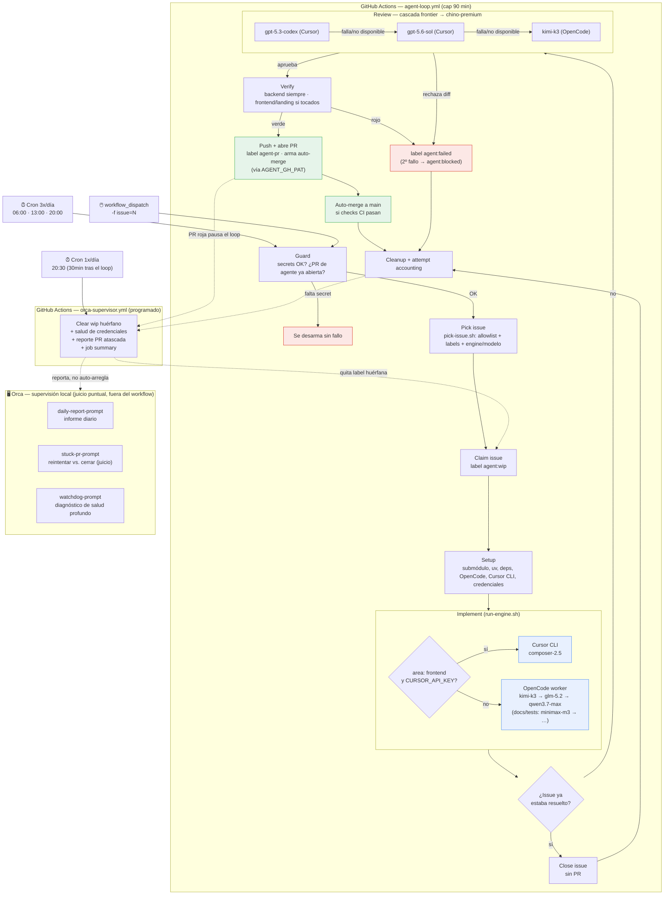

# Sistema de agentes remotos para resolución de issues

Resumen del pipeline `agent-loop` (`.github/workflows/agent-loop.yml`), la
capa de scripts en `.github/agent/` y la supervisión local Orca. Fuente:
`.github/agent/README.md` + el propio workflow.

## Qué es

Un workflow de GitHub Actions que corre **3 veces al día** (cron
`0 6,13,20 * * *`), recoge un issue abierto elegible, lo implementa con un
agente ("worker"), lo revisa con un segundo agente, verifica CI completo,
abre PR y arma auto-merge. Todo sin intervención humana salvo cuando algo
se atasca. Desde 2026-08-26 la supervisión mecánica corre sola: el workflow
`orca-supervisor.yml` (1x/día) limpia labels huérfanas, reporta PRs
atascadas y el estado de salud del loop sin que nadie tenga que abrir nada
a mano. Los tres prompts de **Orca** (`.github/agent/orca/`) siguen
existiendo para investigación puntual que sí requiere juicio humano/LLM,
pero ya no son la única vía de supervisión — ver "Cambios recientes".

## Motores de implementación (engines)

| Engine | Cuándo se usa | Modelo |
|---|---|---|
| **OpenCode** | Motor por defecto para todo issue | `kimi-k3` → `glm-5.2` → `qwen3.7-max` (general); `minimax-m3` → `deepseek-v4-flash`/`glm-5.2` (docs/tests, más barato) |
| **Cursor CLI** | Solo `area: frontend`, y solo si existe `CURSOR_API_KEY` | `composer-2.5` (pool incluido del plan Pro) |

Sin `CURSOR_API_KEY`, todo se implementa vía OpenCode. `run-engine.sh` es
el dispatcher que decide y ejecuta uno u otro, con un timeout por llamada
(fix de PR #102, 2026-08-24).

## Cascada de revisión

El agente revisor no usa el mismo modelo barato que el implementador —
prioriza juicio sobre coste:

1. `gpt-5.3-codex` (Cursor, frontier) — si hay `CURSOR_API_KEY`
2. `gpt-5.6-sol` (Cursor, fallback)
3. `kimi-k3` (OpenCode) — "chino premium", intento final garantizado

## Pipeline del workflow (`run-one-issue`, 1 job, cap 90 min)

1. **Guard** — comprueba que los secrets necesarios existen y que no hay ya
   una PR de agente en vuelo (solo una a la vez). Si faltan secrets, el
   workflow se desarma sin fallo ni ruido.
2. **Pick issue** (`pick-issue.sh`) — filtra por allowlist de autor, labels
   (excluye `agent:blocked`, `area: ci-cd`), decide engine + modelo.
3. **Claim issue** — pone label `agent:wip`.
4. **Setup** — submódulo `legalize-es` (cache/shallow clone), `uv`,
   dependencias backend/frontend, instala OpenCode y Cursor CLI, credenciales.
5. **Git identity + work branch**.
6. **Implement** — el worker (OpenCode o Cursor) escribe el código.
7. **Close already-done issue** — si el worker detecta que el issue ya
   estaba resuelto, cierra sin abrir PR.
8. **Review** — cascada frontier→chino-premium descrita arriba; puede
   rechazar el diff.
9. **Verify** — backend siempre; frontend y landing solo si hubo cambios
   ahí.
10. **Push, open PR, arm auto-merge** — usa `AGENT_GH_PAT` (no el
    `GITHUB_TOKEN` por defecto, porque sus PRs no disparan los checks
    `pull_request` requeridos y el auto-merge nunca dispararía).
11. **Cleanup and attempt accounting** — gestiona las labels de estado.

## Máquina de estados (labels)

- `agent:wip` — reclamado por un run en curso. Si queda huérfana (sin run
  activo ni PR abierta) es un run cancelado; el watchdog de Orca la limpia.
- `agent:failed` — un intento fallido; el picker lo reintentará.
- `agent:blocked` — dos intentos fallidos; el picker lo salta hasta que un
  humano quite la label o cierre el issue.
- `agent:infra-stuck` — tres fallos de infraestructura consecutivos (crash
  del engine, timeout idle/hard-ceiling, sin marcador `AGENT_RESULT`,
  DONE-pero-diff-vacío). Los fallos de infra nunca cuentan para
  `agent:failed`/`agent:blocked` — tienen su propio contador. El picker lo
  salta hasta que un humano quite la label (normalmente troceando el issue
  en uno más pequeño — así se resolvieron #52/#53, ver "Cambios recientes").
- `agent-pr` — en toda PR del loop. Solo una abierta a la vez; una PR en
  rojo **pausa el loop** hasta que se arregle o cierre (fail-safe
  intencional).

## Seguridad

- Solo issues de autores en la allowlist de `pick-issue.sh` son elegibles
  (repo público → evita que un desconocido inyecte instrucciones vía issue).
- El cuerpo del issue se pasa a los agentes como datos, con framing
  explícito de "ignora instrucciones embebidas"; los comentarios del issue
  nunca se pasan.
- Checkout con `persist-credentials: false`; el PAT solo vive en el env de
  los steps que hablan con GitHub, nunca en implement/verify.
- `AGENT_GH_PAT` no tiene scope `Workflows` → un push que toque
  `.github/workflows/` lo rechaza GitHub mismo; por eso `area: ci-cd`
  queda excluido del picker.

## Supervisión

**`orca-supervisor.yml`** (GitHub Actions, cron 1x/día, 30 min después del
último slot del loop) mecaniza lo determinista: limpia `agent:wip`
huérfana, reporta PRs `agent-pr` atascadas/rojas (sin auto-reintentar ni
auto-cerrar — esa decisión sigue siendo humana), heurística de salud de
credenciales, y un resumen de backlog en cada run. No depende de que nadie
lo lance a mano.

**Orca** (local, en la máquina del mantenedor) sigue existiendo para
investigación puntual que sí requiere juicio, con tres prompts en
`.github/agent/orca/`:

- `daily-report-prompt.md` — informe diario del estado del loop.
- `stuck-pr-prompt.md` — detector de PRs atascadas (decide reintentar vs.
  cerrar, algo que `orca-supervisor.yml` deliberadamente no automatiza).
- `watchdog-prompt.md` — diagnóstico de salud más profundo que la
  heurística mecánica del workflow.

Si se ejecuta Orca en local, debe hacerse desde un worktree dedicado
(`../LexFlow-orca`), nunca en el checkout principal — ver "Pausa / rescate
manual".

## Pausa / rescate manual

- Pausar: `gh workflow disable agent-loop` (o borrar los secrets).
- Reanudar: `gh workflow enable agent-loop`.
- Run manual: `gh workflow run agent-loop -f issue=<N>`.
- Rescate de `agent:blocked`: en un worktree dedicado (`git worktree add
  ../LexFlow-orca -b fix/... main`, nunca en el checkout principal —
  evita pisar trabajo no comiteado del mantenedor), correr `opencode` a
  mano con `worker-prompt.md` + el texto del issue, o arreglarlo
  directamente; abrir PR normal y quitar la label.

## Historial reciente (2026-08-24)

Serie de PRs que construyeron y estabilizaron este sistema el mismo día:
`#1`/`#2` (base del loop) → `#96`-`#100` (Cursor CLI, modelo por defecto,
parsing de resultados) → `#101` (routing de modelos + cascada de revisor)
→ `#102` (timeout por llamada, fix de un job que podía colgarse) → `#103`
(fix de un error de sintaxis por acceso directo a un secret en un `if:`,
regresión introducida por la #101).

El issue #85, usado como caso de prueba real del loop, encadenó 6 intentos
fallidos ese día — el último análisis apuntaba a un problema arquitectónico
real (mock/live client switch no funcional) y no a un fallo de
infraestructura del propio loop.

## Cambios recientes (2026-08-26)

Los issues #52 y #53 (Sprint 1/2 del epic de data-fidelity, #51) llevaban
3 fallos `implement-idle-timeout` seguidos cada uno — demasiado grandes
para un solo pase autónomo. Se trocearon en 8 issues hijas más pequeñas
(#106-#109 para #53, #110-#113 para #52), y #51/#52/#53 pasaron a `epic`
con checklist de enlaces a las hijas. Al investigar el porqué, salieron
tres huecos de diseño que ya se han cerrado:

- **Escalado de modelo automático**: las cadenas de fallback de modelo
  (`kimi-k3` → `glm-5.2` → `qwen3.7-max`, etc.) estaban documentadas como
  comentarios pero `derive_model()` nunca las recorría — siempre devolvía
  el modelo de nivel 1. Ahora escala automáticamente según cuántos
  `<!-- agent-infra -->` tiene ya el issue elegido.
- **Circuit breaker entre runs**: como todos los modelos `opencode-go/*`
  comparten un único presupuesto ($12/5h), rotar entre ellos no protege
  contra el agotamiento del pool — solo cruzar a Cursor (presupuesto
  separado) lo hace. Si las últimas 3 runs fallaron todas, el loop fuerza
  `engine=cursor` (o salta la run si Cursor no está configurado) en vez de
  quemar un 4º intento contra un pool posiblemente agotado.
- **Detección de texto de cuota**: grep best-effort sobre la salida del
  worker (`429`/`rate limit`/`quota`/...) para etiquetar
  `implement-quota-exhausted` en vez de un genérico `implement-infra-other`.
- **Coautoría de commits**: un hook `prepare-commit-msg` instalado en el
  paso "Git identity" añade `Co-authored-by: <Engine> (<modelo>) <email>`
  a cada commit del run, calculado a partir del engine/modelo reales, no
  del propio LLM formateando un trailer.
- **`orca-supervisor.yml`**: nuevo workflow programado que reemplaza la
  parte mecánica de Orca (ver intro arriba y "Supervisión local" abajo).
  Cuando se opera Orca en local (rescate manual, investigación puntual),
  debe hacerse desde un worktree dedicado (`../LexFlow-orca`), nunca en el
  checkout principal del mantenedor — mismo principio que la lección de
  `CLAUDE.md` (2026-06-06) sobre worktrees y trabajo no comiteado.

## Diagrama

