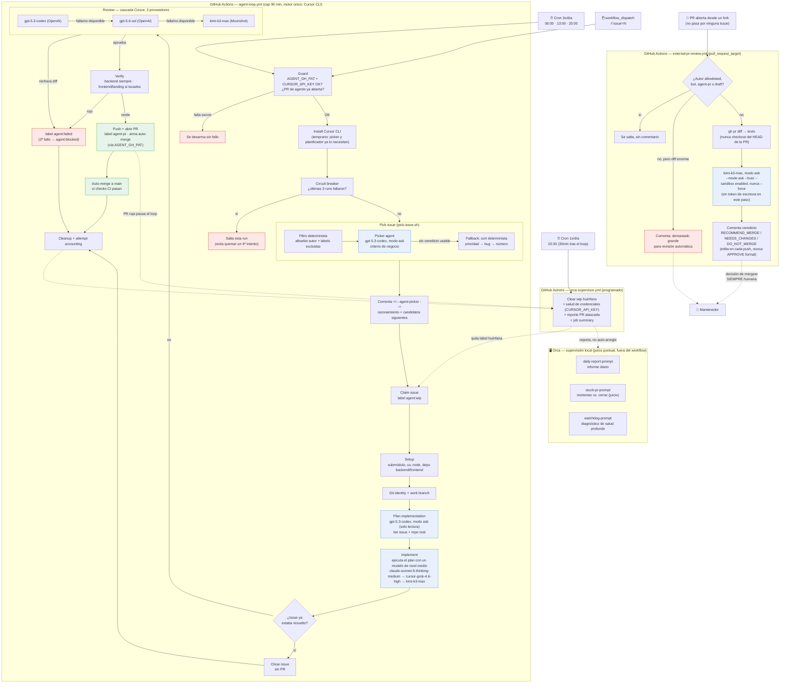

# Sistema de agentes remotos para resolución de issues

Resumen del pipeline `agent-loop` (`.github/workflows/agent-loop.yml`), la
capa de scripts en `.github/agent/` y la supervisión local Orca. Fuente:
`.github/agent/README.md` + el propio workflow.

## Qué es

Un workflow de GitHub Actions que corre **3 veces al día** (cron
`0 6,13,20 * * *`): un agente elige un issue abierto elegible con criterio de
negocio (no un sort ciego), un segundo agente de solo lectura planifica la
implementación, un worker Cursor CLI ejecuta ese plan, un cuarto agente
revisa el diff, verifica CI completo, abre PR y arma auto-merge. Todo sin
intervención humana salvo cuando algo se atasca. Desde 2026-08-26 la
supervisión mecánica corre sola: el workflow `orca-supervisor.yml` (1x/día)
limpia labels huérfanas, reporta PRs atascadas y el estado de salud del loop
sin que nadie tenga que abrir nada a mano. Los tres prompts de **Orca**
(`.github/agent/orca/`) siguen existiendo para investigación puntual que sí
requiere juicio humano/LLM, pero ya no son la única vía de supervisión — ver
"Cambios recientes". Desde la misma fecha, `external-pr-review.yml` cubre la
otra puerta de entrada de un repo público — una PR abierta directamente desde
un fork, sin pasar por ninguna issue — con una revisión de solo lectura,
nunca autoritativa: nunca mergea, nunca ejecuta código de la PR, solo deja un
comentario recomendando o desaconsejando el merge para que un humano decida.

Desde 2026-08-28 todo el sistema corre sobre un único motor, **Cursor CLI**
(`cursor-agent`) — opencode se retiró por completo tras fallar
repetidamente sin dar a entender el error real que tenía. Ver "Cambios
recientes" para el detalle.

## Motor de implementación

Todo pasa por `run-engine.sh`, que ejecuta `cursor-agent` en uno de dos
modos según la variable `ENGINE_MODE`:

| Modo | Uso | Flags |
|---|---|---|
| `full` (por defecto) | Implement, Review — código propio y confiado | `-p --force` |
| `ask` | Picker, planificador, revisor de PRs externas — solo lectura, nunca escritura | `-p --mode ask --trust --sandbox enabled` (nunca `--force`) |

`CURSOR_API_KEY` es ahora un secret **obligatorio** (ya no hay motor de
fallback) — sin él, el Guard desarma el loop entero en el primer paso, igual
que si faltara `AGENT_GH_PAT`.

## Selección de issue

`pick-issue.sh` filtra candidatos de forma determinista (autor en
allowlist, sin labels excluidas — `agent:blocked`/`agent:infra-stuck` ya
quedan fuera del pool) y entrega los supervivientes a un agente picker
(`gpt-5.3-codex`, modo `ask`) en vez de ordenarlos ciegamente por
prioridad/bug/número. El picker valora dependencias declaradas entre
issues, historial de reintentos, labels de prioridad/bug y urgencia descrita
en el cuerpo. Si no devuelve una elección utilizable, `pick-issue.sh` cae al
mismo sort determinista de siempre — el picker nunca es un nuevo punto único
de fallo. La elección queda por escrito como comentario
`<!-- agent-picker -->` en el issue elegido: razonamiento, candidatos
siguientes considerados, y qué issues ya bloqueados se descartaron y por qué.

## Planificación de la implementación

Antes de que el worker escriba código, un agente de solo lectura
(`gpt-5.3-codex`, modo `ask`) lee el issue y el repo real ya clonado y
escribe un plan de implementación — ficheros a tocar, patrones existentes a
reutilizar, casos límite. Ese plan se inyecta en el prompt del worker como
sección "Plan de implementación a seguir". Por eso el modelo de
Implementación (tabla abajo) puede ser de nivel medio en vez de frontier: el
razonamiento caro sobre el enfoque ya está hecho, el worker solo tiene que
ejecutarlo. Un plan fallido o vacío es un fallo blando — el worker sigue
adelante razonando desde el issue directamente, como antes de que esto
existiera.

## Modelos por tarea

| Tarea | Modelo | Nota |
|---|---|---|
| Selección de issue | `gpt-5.3-codex` | Llamada única por ciclo, sin cascada |
| Planificación | `gpt-5.3-codex` | Llamada única por ciclo, sin cascada |
| Implementación (general) | `claude-sonnet-5-thinking-medium` → `cursor-grok-4.6-high` → `kimi-k3-max` | Nivel medio — EJECUTA un plan, no lo diseña |
| Implementación (`area: docs`) | `gpt-5.4-mini` → `gemini-3.7-flash-high` → `kimi-k2.7-code` | Tier más barato |
| Implementación (`area: tests`) | `kimi-k2.7-code` → `gpt-5.4-mini` → `gemini-3.7-flash-high` | Modelo code-capable primero |
| Revisión | `gpt-5.3-codex` → `gpt-5.6-sol` → `kimi-k3-max` | Frontier primero, Moonshot como intento final garantizado |
| Revisor de PRs externas | `kimi-k3-max` (sin cascada) | Modo `ask`, solo lectura |

Cada cascada mezcla proveedor upstream distinto (Anthropic/xAI/Moonshot en
implementación general; OpenAI/Google/Moonshot en docs/tests) para que un
fallo de un solo proveedor no tumbe las 3 opciones — mismo principio que ya
usaba la lista original de OpenCode.

## Pipeline del workflow (`run-one-issue`, 1 job, cap 90 min)

1. **Guard** — comprueba que los secrets necesarios existen (`AGENT_GH_PAT`,
   `CURSOR_API_KEY`) y que no hay ya una PR de agente en vuelo (solo una a la
   vez). Si faltan secrets, el workflow se desarma sin fallo ni ruido.
2. **Install Cursor CLI** — pronto, antes de Pick issue: el picker y el
   planificador ya necesitan `cursor-agent`.
3. **Circuit breaker** — si las últimas 3 runs fallaron seguidas, salta esta
   run en vez de quemar un 4º intento contra una cuota posiblemente agotada.
4. **Pick issue** (`pick-issue.sh`) — filtra por allowlist/labels, delega la
   elección en el picker (ver arriba), deriva modelo.
5. **Claim issue** — pone label `agent:wip`.
6. **Setup** — submódulo `legalize-es` (cache/shallow clone), `uv`, node,
   dependencias backend/frontend.
7. **Git identity + work branch**.
8. **Plan implementation** — el planificador de solo lectura (ver arriba).
9. **Implement** — el worker Cursor ejecuta el plan.
10. **Close already-done issue** — si el worker detecta que el issue ya
    estaba resuelto, cierra sin abrir PR.
11. **Review** — cascada de revisión descrita arriba; puede rechazar el diff.
12. **Verify** — backend siempre; frontend y landing solo si hubo cambios
    ahí.
13. **Push, open PR, arm auto-merge** — usa `AGENT_GH_PAT` (no el
    `GITHUB_TOKEN` por defecto, porque sus PRs no disparan los checks
    `pull_request` requeridos y el auto-merge nunca dispararía).
14. **Cleanup and attempt accounting** — gestiona las labels de estado.

## Máquina de estados (labels)

- `agent:wip` — reclamado por un run en curso. Si queda huérfana (sin run
  activo ni PR abierta) es un run cancelado; el watchdog de Orca la limpia.
- `agent:failed` — un intento fallido; el picker lo reintentará.
- `agent:blocked` — dos intentos fallidos; el picker lo salta hasta que un
  humano quite la label o cierre el issue.
- `agent:infra-stuck` — tres fallos de infraestructura consecutivos (crash
  del engine, timeout idle/hard-ceiling, sin marcador `AGENT_RESULT`,
  DONE-pero-diff-vacío). Los fallos de infra nunca cuentan para
  `agent:failed`/`agent:blocked` — tienen su propio contador. El picker lo
  salta hasta que un humano quite la label (normalmente troceando el issue
  en uno más pequeño — así se resolvieron #52/#53, ver "Cambios recientes").
- `agent-pr` — en toda PR del loop. Solo una abierta a la vez; una PR en
  rojo **pausa el loop** hasta que se arregle o cierre (fail-safe
  intencional).

Además de las labels, cada pick queda documentado como comentario
`<!-- agent-picker -->` en el issue elegido (ver "Selección de issue"
arriba) — no es un estado nuevo, es el registro escrito de por qué se eligió
ese issue y no otro.

## Seguridad

- Solo issues de autores en la allowlist de `pick-issue.sh` son elegibles
  (repo público → evita que un desconocido inyecte instrucciones vía issue).
- El cuerpo del issue se pasa a los agentes como datos, con framing
  explícito de "ignora instrucciones embebidas"; los comentarios del issue
  nunca se pasan.
- Checkout con `persist-credentials: false`; el PAT solo vive en el env de
  los steps que hablan con GitHub, nunca en implement/verify.
- `AGENT_GH_PAT` no tiene scope `Workflows` → un push que toque
  `.github/workflows/` lo rechaza GitHub mismo; por eso `area: ci-cd`
  queda excluido del picker.

## Supervisión

**`orca-supervisor.yml`** (GitHub Actions, cron 1x/día, 30 min después del
último slot del loop) mecaniza lo determinista: limpia `agent:wip`
huérfana, reporta PRs `agent-pr` atascadas/rojas (sin auto-reintentar ni
auto-cerrar — esa decisión sigue siendo humana), heurística de salud de
credenciales, y un resumen de backlog en cada run. No depende de que nadie
lo lance a mano.

**Orca** (local, en la máquina del mantenedor) sigue existiendo para
investigación puntual que sí requiere juicio, con tres prompts en
`.github/agent/orca/`:

- `daily-report-prompt.md` — informe diario del estado del loop.
- `stuck-pr-prompt.md` — detector de PRs atascadas (decide reintentar vs.
  cerrar, algo que `orca-supervisor.yml` deliberadamente no automatiza).
- `watchdog-prompt.md` — diagnóstico de salud más profundo que la
  heurística mecánica del workflow.

Si se ejecuta Orca en local, debe hacerse desde un worktree dedicado
(`../LexFlow-orca`), nunca en el checkout principal — ver "Pausa / rescate
manual".

## Pausa / rescate manual

- Pausar: `gh workflow disable agent-loop` (o borrar los secrets).
- Reanudar: `gh workflow enable agent-loop`.
- Run manual: `gh workflow run agent-loop -f issue=<N>`.
- Rescate de `agent:blocked`: en un worktree dedicado (`git worktree add
  ../LexFlow-orca -b fix/... main`, nunca en el checkout principal —
  evita pisar trabajo no comiteado del mantenedor), correr `cursor-agent` a
  mano con `worker-prompt.md` + el texto del issue, o arreglarlo
  directamente; abrir PR normal y quitar la label.

## Historial reciente (2026-08-24)

Serie de PRs que construyeron y estabilizaron este sistema el mismo día:
`#1`/`#2` (base del loop) → `#96`-`#100` (Cursor CLI, modelo por defecto,
parsing de resultados) → `#101` (routing de modelos + cascada de revisor)
→ `#102` (timeout por llamada, fix de un job que podía colgarse) → `#103`
(fix de un error de sintaxis por acceso directo a un secret en un `if:`,
regresión introducida por la #101).

El issue #85, usado como caso de prueba real del loop, encadenó 6 intentos
fallidos ese día — el último análisis apuntaba a un problema arquitectónico
real (mock/live client switch no funcional) y no a un fallo de
infraestructura del propio loop.

## Cambios recientes (2026-08-26)

Los issues #52 y #53 (Sprint 1/2 del epic de data-fidelity, #51) llevaban
3 fallos `implement-idle-timeout` seguidos cada uno — demasiado grandes
para un solo pase autónomo. Se trocearon en 8 issues hijas más pequeñas
(#106-#109 para #53, #110-#113 para #52), y #51/#52/#53 pasaron a `epic`
con checklist de enlaces a las hijas. Al investigar el porqué, salieron
tres huecos de diseño que ya se han cerrado:

- **Escalado de modelo automático**: las cadenas de fallback de modelo
  (`kimi-k3` → `glm-5.2` → `qwen3.7-max`, etc.) estaban documentadas como
  comentarios pero `derive_model()` nunca las recorría — siempre devolvía
  el modelo de nivel 1. Ahora escala automáticamente según cuántos
  `<!-- agent-infra -->` tiene ya el issue elegido.
- **Circuit breaker entre runs**: como todos los modelos `opencode-go/*`
  comparten un único presupuesto ($12/5h), rotar entre ellos no protege
  contra el agotamiento del pool — solo cruzar a Cursor (presupuesto
  separado) lo hace. Si las últimas 3 runs fallaron todas, el loop fuerza
  `engine=cursor` (o salta la run si Cursor no está configurado) en vez de
  quemar un 4º intento contra un pool posiblemente agotado.
- **Detección de texto de cuota**: grep best-effort sobre la salida del
  worker (`429`/`rate limit`/`quota`/...) para etiquetar
  `implement-quota-exhausted` en vez de un genérico `implement-infra-other`.
- **Coautoría de commits**: un hook `prepare-commit-msg` instalado en el
  paso "Git identity" añade `Co-authored-by: <Engine> (<modelo>) <email>`
  a cada commit del run, calculado a partir del engine/modelo reales, no
  del propio LLM formateando un trailer.
- **`orca-supervisor.yml`**: nuevo workflow programado que reemplaza la
  parte mecánica de Orca (ver intro arriba y "Supervisión local" abajo).
  Cuando se opera Orca en local (rescate manual, investigación puntual),
  debe hacerse desde un worktree dedicado (`../LexFlow-orca`), nunca en el
  checkout principal del mantenedor — mismo principio que la lección de
  `CLAUDE.md` (2026-06-06) sobre worktrees y trabajo no comiteado.
- **`external-pr-review.yml`**: el allowlist de `pick-issue.sh` solo protege
  el lado de las issues — alguien de fuera puede abrir una PR directamente
  desde un fork sin pasar por ninguna issue. Este workflow nuevo la revisa
  (ver sección propia abajo) sin poder nunca mergearla ni ejecutar su código.

## Cambios recientes (2026-08-28)

`opencode` llevaba fallando de forma repetida en el loop sin dar información
clara del error real (motivo del cambio, comunicado directamente por el
mantenedor). Se retiró por completo y todo el sistema pasó a correr sobre un
único motor, Cursor CLI:

- **Motor único**: `run-engine.sh` perdió la rama `opencode)`; ahora solo
  soporta `cursor`, en dos modos (`full`/`ask`, ver "Motor de
  implementación" arriba). `CURSOR_API_KEY` pasó de secret opcional a
  obligatorio — sin él el Guard desarma el loop entero, igual que sin
  `AGENT_GH_PAT`.
- **Picker basado en agente**: `pick-issue.sh` dejó de elegir issue con un
  `jq sort_by` ciego — ahora un agente (`gpt-5.3-codex`, modo `ask`) elige
  con criterio de negocio entre los candidatos ya filtrados, con fallback
  determinista si no devuelve una elección utilizable (ver "Selección de
  issue" arriba). El mecanismo de "issue muy reintentado → pasa a revisión
  humana" no cambió — ya existía vía `agent:blocked`/`agent:infra-stuck`; lo
  nuevo es que la elección entre los candidatos elegibles ahora tiene
  criterio, y queda documentada por escrito en un comentario del issue.
- **Planificador de implementación**: nuevo paso de solo lectura antes de
  Implement (ver "Planificación de la implementación" arriba) — permite que
  el modelo de implementación baje de familias frontier a nivel medio
  (`claude-sonnet-5-thinking-medium` en vez de `kimi-k3`), porque ya no
  tiene que razonar el enfoque desde cero.
- **Verificado en local antes de escribir código**: se probó `cursor-agent`
  autenticado en esta máquina antes de diseñar el picker/planificador —
  `--mode plan` no sirve para uso no interactivo (no devuelve el plan por
  stdout en `-p`), así que ambos usan `--mode ask --trust`; y se confirmó
  que `--mode ask` por sí solo se bloquea en el prompt de confianza del
  workspace sin `--trust`, algo que no estaba documentado antes de probarlo.
- **`external-pr-review.yml`**: pasó del config `opencode-external-review.json`
  (`permission: deny` en edit/bash/webfetch) al equivalente en Cursor —
  `--mode ask --trust --sandbox enabled`, nunca `--force`/`--yolo`.

## Revisión de PRs externas

`external-pr-review.yml` (trigger `pull_request_target`, tipos
`opened`/`synchronize`/`reopened`) es la contraparte de seguridad del
allowlist de issues, pero para PRs. Se salta silenciosamente si el autor
está en el allowlist, es un bot, la PR ya lleva label `agent-pr` (es del
propio loop), es un draft, o el diff supera 1500 líneas/50 ficheros (en ese
caso comenta que es demasiado grande, sin gastar una llamada al modelo).

Para lo demás: obtiene el diff como **texto** vía la API (`gh pr diff`,
nunca hace `checkout` del HEAD de la PR ni ejecuta nada de su código — el
paso de checkout se queda siempre en `main`), se lo pasa a `cursor-agent`
(`kimi-k3-max`, sin cascada) ejecutado en `ENGINE_MODE=ask` — `--mode ask
--trust --sandbox enabled`, **nunca** `--force`/`--yolo` — aunque el diff
contenga una inyección de prompt, el modelo no tiene ninguna herramienta que
ejecutar. El paso que llama al LLM nunca lleva un token con permiso de
escritura en su entorno; solo el paso posterior que publica el comentario lo
tiene, ya con el output del LLM capturado a fichero.

El veredicto (`RECOMMEND_MERGE` / `NEEDS_CHANGES` / `DO_NOT_MERGE`) se
publica siempre como **comentario normal**, nunca como review formal de
GitHub (`APPROVE`/`REQUEST_CHANGES`) — la protección de rama de `main` hoy
no exige ninguna review aprobatoria, así que un `APPROVE` de bot no
desbloquea nada que un humano no pudiera ya hacer, pero sí daría una falsa
sensación de autoridad, y se volvería un riesgo real si esa política cambia
algún día. El comentario se edita en cada `synchronize` en vez de duplicarse
en cada push. **La decisión de mergear sigue siendo siempre humana.**

Como `pull_request_target` solo ejecuta la versión del workflow que ya está
en la rama por defecto, no se puede probar de extremo a extremo desde la
propia PR que lo introduce — se verifica después con
`gh workflow run external-pr-review -f pr_number=<N>` contra una PR externa
real ya abierta.

## Diagrama

